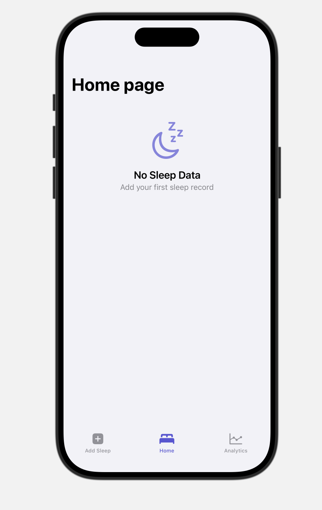
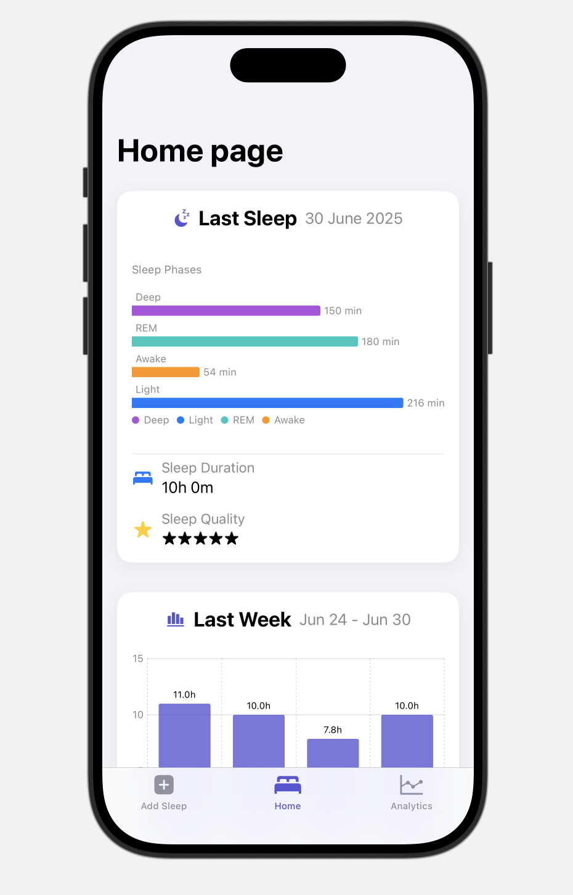
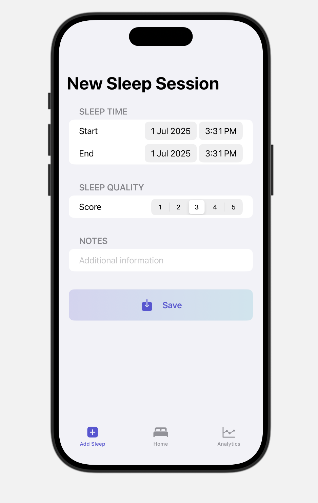
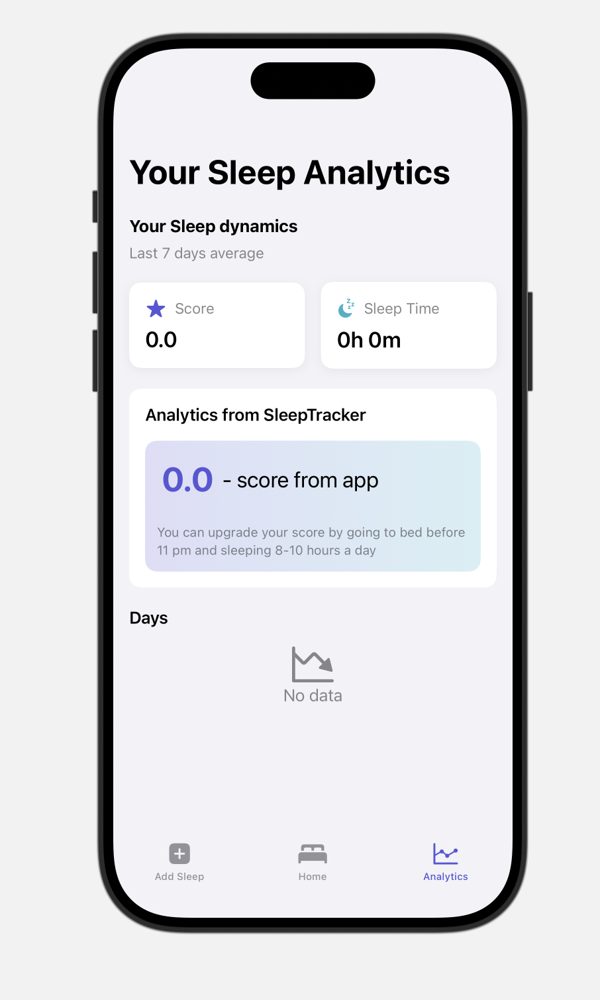
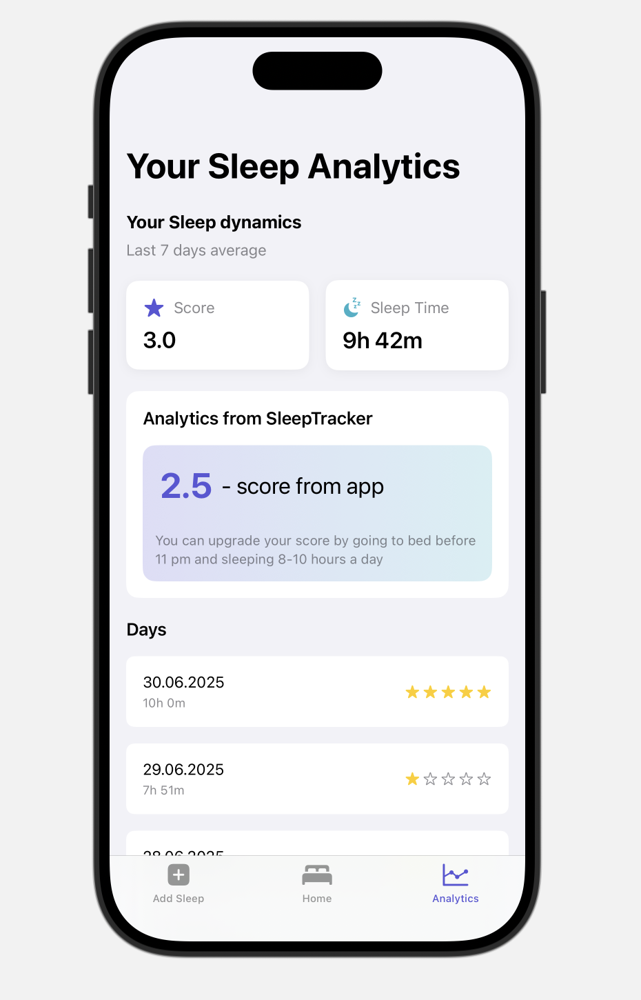

# 😴 SleepTracker 

## 🏗️ Описание проекта

IOS приложение для отслеживания сна, реализованное на Swift. 

- **App** - точка входа: `SleepTrackerApp` -> `ContentView`.
- **Data** — работа с данными с помощью `SleepRepository`.
- **Domain** — описание сущностей: `SleepSession`.
- **Presentation** — пользовательский интерфейс в  `Screens/`:
    - `Home/` - главный экран.
    - `AddSleep/` - добавление записи.
    - `Analytics/` - аналитика.
    
- **UseCases** — бизнес-логика. 
---

## 📱 Экраны
### 🏠 Главный экран `Home`:
- **Last Sleep** - информация о последнем сне.

- **Last Week Sleep** - график сна за последнюю неделю.

| Состояние | Скриншот |
|-----------|----------|
| Нет данных |  |
| С данными |  |

---

### ✏️ Добавление записи `AddSleep`:
- Форма для добавления записи о сне.

#### Экран с формой:

---

### 📊 Аналитика `Analytics`:
- **WeekDynamics** - анализ записей за последнюю нелелю.
- **DailySleep** - краткие данные по дням.

| Состояние | Скриншот |
|-----------|----------|
| Нет данных |  |
| С данными |  |

---

## 🛠️ Технологии

- **SwiftUI** — построение интерфейсов.
- **SwiftData** — хранение записей.
- **Charts** — визуализация статистики.

:))
